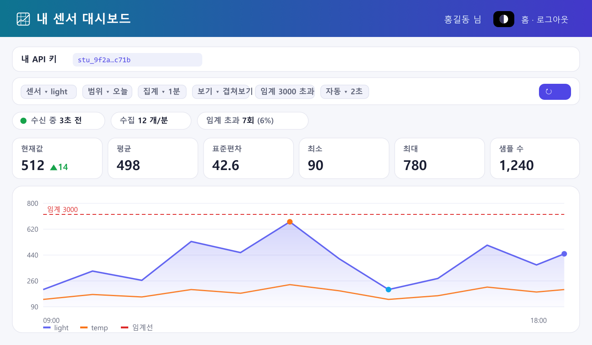
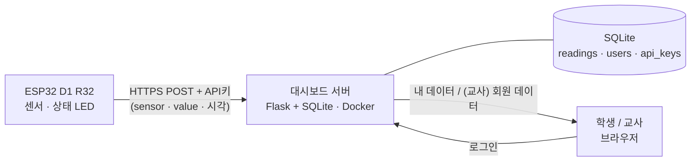
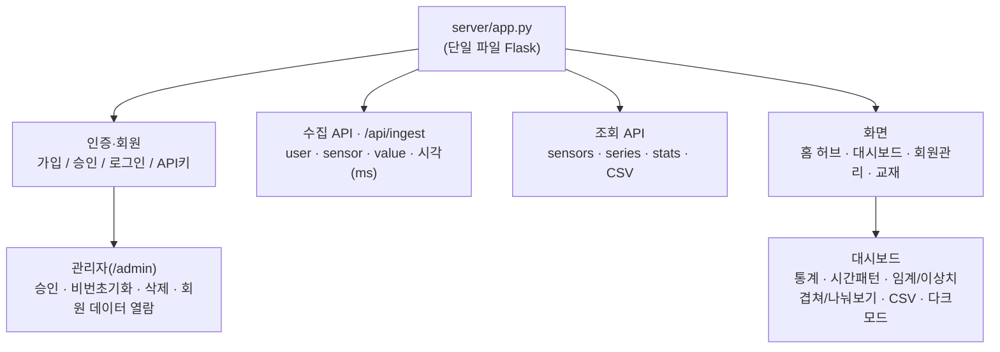

# IoT 센서 실시간 · 누적 대시보드

ESP32가 WiFi로 보낸 센서 값을 **실시간 시각화**하고 **계정별로 누적**하는 교육용 대시보드입니다.
학생마다 로그인·API 키가 발급되어 **자기 데이터만** 조회하며, 교사는 관리자 계정으로 전체 현황을 봅니다.
누구나 AWS·자체 서버에 올려 운영할 수 있도록 배포 구성을 함께 제공합니다.

```
[ESP32 + 센서] ──WiFi(HTTP POST + API키)──▶ [서버: Flask + SQLite] ◀──로그인── [학생/교사 브라우저]
                                                     │
                                     실시간 그래프 · 기간/집계 조회 · CSV 내보내기
```

## 🖼 구동 화면



> 로그인 후 화면 — 통계 카드(현재값·평균·표준편차·최소·최대·샘플 수), 수신 상태·수집 속도·임계 초과, 여러 센서 **겹쳐보기**, **임계선·이상치**까지. *(예시 데이터로 구성한 미리보기)*

## 🗺 시스템 구조



> 공개 방법(배포)만 3가지 중 선택: **A** Cloudflare Tunnel(공인 IP 불필요) · **B** 단순 IP(HTTP) · **C** 클라우드+도메인 자동 HTTPS. 서버·데이터는 동일.

## 🧩 기능 구조



## ✨ 기능

- 계정(회원가입·로그인) + 학생별 **API 키** 발급 — 장치 인증과 사람 인증 분리
- 실시간 수집·누적 (밀리초 타임스탬프 시계열)
- 센서 이름별 구분 조회, 기간(최근~전체)·집계 단위(원본~1일 평균) 선택, CSV 내보내기
- 관리자(/admin) 전체 학생 수집 현황
- 단일 파일 Flask 서버 + SQLite — 의존성 최소, 어디서나 실행

## 📁 저장소 구조

```
server/          대시보드 서버 (Flask 단일 파일 + Dockerfile)
firmware/        ESP32 전송 코드 (배선·설정 가이드 포함)
deploy/          배포 구성 3종 ─ cloudflare/  A. 도메인+자동 HTTPS (공인 IP 불필요)
                              ├ direct-ip/   B. 단순 IP:포트 공개 (가장 간단)
                              └ aws-https/   C. 클라우드+도메인+자동 HTTPS (Caddy)
local-logger/    방법1 · 배포 없이 내 PC에서 바로 쓰는 간이 대시보드
examples/        교재 실습 예제 (유선→무선 단계별)
docs/            문서용 이미지(구동 화면 등)
data/            (실행 후 생성) SQLite 데이터 — 백업은 이 폴더만
```

## 🚀 빠른 시작

### 1) 로컬에서 바로 실행 (배포 없이 맛보기)

```bash
pip install -r server/requirements.txt
python server/app.py            # → http://localhost:8000
```

### 2) 서버에 배포 — 두 가지 방식 중 선택

| | A. Cloudflare Tunnel | B. 단순 IP 매핑 | C. 클라우드 + HTTPS |
|---|---|---|---|
| 접속 | `https://dashboard.내도메인.com` | `http://<서버IP>:8000` | `https://dashboard.내도메인.com` |
| HTTPS | ✅ 자동 | ❌ (실습용) | ✅ 자동 (Caddy) |
| 공인 IP | 불필요 (내부망·집 OK) | 필요 | 필요 (**AWS 등 클라우드**) |
| 준비물 | 도메인 + Cloudflare | 없음 | 도메인 + 인스턴스 |
| 가이드 | [deploy/cloudflare](deploy/cloudflare/README.md) | [deploy/direct-ip](deploy/direct-ip/README.md) | [deploy/aws-https](deploy/aws-https/README.md) |

선택이 고민되면 → [deploy/README.md](deploy/README.md) (비교·권장 시나리오)

```bash
# 예: C. AWS 등 클라우드 + 도메인 자동 HTTPS
cp deploy/aws-https/.env.example deploy/aws-https/.env    # DOMAIN·SECRET_KEY 채우기
docker compose -f deploy/aws-https/docker-compose.yml up -d --build   # Caddy가 인증서 자동 발급

# 예: B. 단순 IP 방식 (빠른 HTTP 테스트)
cp deploy/direct-ip/.env.example deploy/direct-ip/.env
docker compose -f deploy/direct-ip/docker-compose.yml up -d --build
```

### 3) 장치(ESP32) 연결

[firmware/README.md](firmware/README.md) — 배선 후 코드 상단 4곳(WiFi·서버 주소·API 키)만 수정해 업로드하면
대시보드에 값이 실시간으로 쌓입니다.

## 🧰 설치 (요약)

| 대상 | 설치할 것 | 상세 가이드 |
|---|---|---|
| 서버 (권장) | Docker — Linux: `apt install docker.io docker-compose-v2` · Windows/Mac: [Docker Desktop](https://www.docker.com/products/docker-desktop) | [deploy/direct-ip](deploy/direct-ip/README.md) · [deploy/cloudflare](deploy/cloudflare/README.md) |
| 서버 (도커 없이) | Python 3.10+ → `pip install -r server/requirements.txt` | [deploy/direct-ip §3-1](deploy/direct-ip/README.md) |
| 장치 | Arduino IDE 2.x + ESP32 보드 패키지 (+ Windows는 CP210x/CH340 드라이버) | [firmware/README §0](firmware/README.md) |
| 하드웨어 | ESP32 보드(Arduino D1 R32 등), 조도센서(CDS)+1kΩ, 점퍼선 | [firmware/README](firmware/README.md) |

## 🙋 만든 사람

**박정호** · 세종 온라인학교 · <powerspty@gmail.com>

## 📄 라이선스

MIT — 교육 목적의 수정·재배포를 환영합니다.
